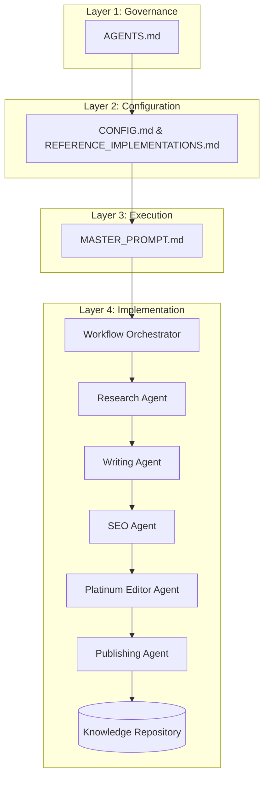

# LEOS System Architecture

LEOS operates on a strict, 4-layer architectural model, ensuring that every document and agent adheres to the Single Responsibility Principle.

## 4-Layer Architecture

## Layer Separation

### 1. Governance Layer (`AGENTS.md`)

Owns the high-level boundaries, permissions, frozen policies, and responsibilities.

### 2. Configuration Layer (`CONFIG.md` & `REFERENCE_IMPLEMENTATIONS.md`)

Owns the global repository settings, default workflow preferences, and certified editorial benchmarks.

### 3. Execution Layer (`MASTER_PROMPT.md`)

The official constitutional manual defining the operational behavior of the Workflow Orchestrator, pipeline routing, and automation steps.

### 4. Implementation Layer (Specialist Agents)

The actual components performing the work.

- The **Orchestrator** coordinates the flow but does no editorial work.
- The **Research Agent** verifies facts but does not write articles.
- The **Writing Agent** generates the MDX but performs zero independent research.
- The **SEO Agent** and **Platinum Editor** perform strictly read-only audits to generate `PATCH` files.
- The **Publishing Agent** acts as the release gate.
- The **Knowledge Repository** persists the generated artifacts.

## Dependency Rules

Lower-level layers and agents must never interact with or know about higher-level agents. The Writing Agent does not call the SEO Agent; the Orchestrator handles the handoff based on the Execution Layer.

## Stateless Orchestration

The Workflow Orchestrator maintains no permanent memory. If the pipeline is interrupted, it resumes by reading the file system (e.g., checking if `RESEARCH_REPORT.md` exists) rather than relying on session history.
