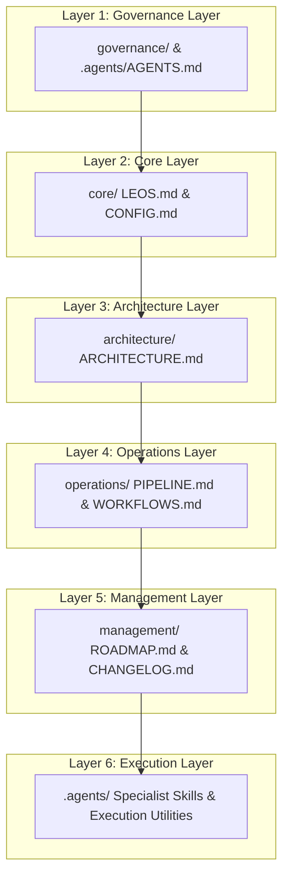

# LEOS Architecture

## Purpose

The Locitra Editorial Operating System (LEOS) Architecture Specification defines the structural topology, subsystem boundaries, layer responsibilities, dependency rules, and information flow model for the LEOS framework.

This document serves as the authoritative architectural specification for LEOS. It defines **how** the system is structurally organized and integrated, establishing strict architectural boundaries to guarantee modularity, maintainability, and long-term stability across all editorial subsystems.

## Architectural Scope

This specification applies exclusively to the structural design, component topology, layer hierarchy, and interface boundaries of LEOS within the Locitra repository.

- **In Scope:**
  - Structural layer definitions and responsibilities.
  - Subsystem boundary definitions and domain ownership models.
  - Permitted and prohibited dependency directions.
  - High-level information flow and stateless artifact interaction models.
  - Physical repository mapping of architectural layers.
  - Architectural extension principles for scaling the system.

- **Out of Scope:**
  - Foundational philosophy and constitutional mandates (governed by [core/LEOS.md](../core/LEOS.md)).
  - Repository navigation and directory browsing guides (governed by [README.md](../README.md)).
  - Step-by-step linear execution pipelines and release gate procedures (governed by [operations/PIPELINE.md](../operations/PIPELINE.md)).
  - Implementation details of individual application source code or specific runtime prompt templates.

## Architectural Principles

The LEOS architecture is constructed upon seven core architectural principles:

- **Modularity:** The system is partitioned into discrete, single-purpose subsystems and specialist components with minimal coupling.
- **Separation of Concerns:** Each layer and subsystem owns a distinct domain responsibility (e.g., governance, configuration, architecture, operations, management, execution), preventing domain overlap or logic leakage.
- **Single Source of Truth:** Every structural definition, interface contract, and architectural boundary is defined in exactly one authoritative specification to eliminate documentation redundancy and ambiguity.
- **Layered Design:** The system enforces a strict multi-layer architectural hierarchy where higher-level governance and core specifications constrain and direct lower-level operational and execution components.
- **Stateless Components:** Orchestration and specialist modules execute statelessly, deriving state strictly from filesystem artifacts rather than volatile memory or persistent runtime databases.
- **Explicit Boundaries:** Interfaces and interaction paths between subsystems are strictly defined; direct horizontal communication or upward dependency calls are explicitly prohibited.
- **Architectural Decision Philosophy:** Major architectural decisions should be deliberate, documented, reviewed, and implemented through controlled evolution rather than ad hoc modification.

## Architectural Layers

LEOS is organized into six functional architectural layers, each owning exclusive responsibility for its domain:



### 1. Governance Layer

Owns supreme operational policies, human-in-the-loop oversight boundaries, contribution standards, and frozen repository constraints.

### 2. Core Layer

Owns the system constitution, operating manual, global repository settings, default workflow preferences, and master orchestrator prompt definitions.

### 3. Architecture Layer

Owns structural specifications, subsystem topology, directory standards, component boundary rules, and extension principles.

### 4. Operations Layer

Owns execution pipelines, supported workflow definitions, release gate verification rules, and onboarding procedures.

### 5. Management Layer

Owns version tracking, modification changelogs, strategic roadmaps, deferred document management, and release history.

### 6. Execution Layer

Owns specialized AI agent skill definitions, execution utilities, knowledge repositories, and generated editorial markdown artifacts.

## Subsystem Boundaries

LEOS enforces clear subsystem ownership across seven discrete functional modules:

| Subsystem                      | Primary Ownership | Domain Responsibilities                                                                                    |
| :----------------------------- | :---------------- | :--------------------------------------------------------------------------------------------------------- |
| **Governance Subsystem**       | `governance/`     | Contribution rules, operational policies, and human authority perimeters.                                  |
| **Core Operating Subsystem**   | `core/`           | System constitution, global configuration, master prompt execution rules.                                  |
| **Architecture Subsystem**     | `architecture/`   | Structural standards, system topology, directory structure layout specifications.                          |
| **Operations Subsystem**       | `operations/`     | Execution pipeline definitions, workflow paths, operational onboarding guides.                             |
| **Management Subsystem**       | `management/`     | Strategic evolution roadmaps, semantic versioning logs, deferred document registry.                        |
| **Orchestration Subsystem**    | Specialist Skill  | Stateless workflow routing, artifact passing, and pipeline stage coordination.                             |
| **Specialist Agent Subsystem** | Specialist Skills | Dedicated, single-responsibility domains (Research, Writing, SEO Audit, Editorial Audit, Publishing Gate). |

## Information Flow

LEOS implements a file-system-driven, stateless information flow model. Information transitions between layers and subsystems strictly through immutable markdown artifacts written to and read from specified directory locations.

```
+------------------+     Factual Data      +------------------+
| Research Agent   | --------------------> | Research Report  |
+------------------+                       +------------------+
                                                    |
                                                    v
+------------------+     Article Content   +------------------+
| Writing Agent    | <-------------------  |  Draft Article   |
+------------------+                       +------------------+
        |                                           |
        v                                           v
+------------------+      Audit Reports    +------------------+
| Audit Agents     | --------------------> | Patch Artifacts  |
| (SEO & Editor)   |                       +------------------+
+------------------+                                |
                                                    v
+------------------+    Validated Deployment +------------------+
| Publishing Agent | <-------------------- | Knowledge Repo   |
+------------------+                       +------------------+
```

> **Architectural Note:** The diagram illustrates conceptual architectural information flow only. Detailed execution sequencing, workflow orchestration, and release gates are defined exclusively in [operations/PIPELINE.md](../operations/PIPELINE.md).

- **Stateless Artifact Passing:** Subsystems do not exchange memory references or maintain socket connections; all information handoffs occur via file system persistence.
- **Read-Only Audit Flow:** Analytical and quality verification stages read existing content artifacts and produce separate diagnostic report files without mutating source content directly.
- **Explicit Patch Application:** State-modifying changes occur only when audit patch artifacts are explicitly validated and applied by authorized execution routines.

## Dependency Rules

To prevent tight coupling and architectural degradation, LEOS enforces strict top-down dependency rules.

### Permitted Dependency Direction

Dependencies MUST strictly flow top-down, following the architectural layer hierarchy:
`Governance` → `Core` → `Architecture` → `Operations` → `Management` → `Execution`

- Higher layers may reference, constrain, and direct lower layers.
- Lower layers derive authority and configuration from higher layers.

### Prohibited Dependencies

- **No Upward Dependencies:** Lower-level execution components (e.g., specialist agents) must never invoke, modify, or depend upon higher-level governance or architectural definitions.
- **No Horizontal Coupling:** Specialist AI agents must operate in total isolation from one another. Direct agent-to-agent calls are strictly prohibited.
- **No Circular Dependencies:** No subsystem or layer may depend on a component that directly or indirectly depends on it.
- **No Bypass of Core Governance:** Operational pipeline procedures must not bypass or override Core Constitutional rules.

## Repository Mapping

The architectural structure maps directly to the physical directory structure of the repository:

| Architectural Layer    | Repository Path                | Core Artifacts                                                                      |
| :--------------------- | :----------------------------- | :---------------------------------------------------------------------------------- |
| **Governance Layer**   | `LEOS/governance/`, `.agents/` | `CONTRIBUTING.md`, `AGENTS.md`                                                      |
| **Core Layer**         | `LEOS/core/`                   | `LEOS.md`, `CONFIG.md`, `MASTER_PROMPT.md`                                          |
| **Architecture Layer** | `LEOS/architecture/`           | `ARCHITECTURE.md`, `DIRECTORY_STRUCTURE.md`                                         |
| **Operations Layer**   | `LEOS/operations/`             | `PIPELINE.md`, `WORKFLOWS.md`, `QUICK_START.md`, `AGENT_INDEX.md`                   |
| **Management Layer**   | `LEOS/management/`             | `ROADMAP.md`, `CHANGELOG.md`, `VERSION_HISTORY.md`, `DEFERRED_DOCUMENT_REGISTER.md` |
| **Execution Layer**    | `.agents/`                     | Specialist skill prompts, execution tools, reference implementations                |
| **Subsystem Gateway**  | `LEOS/` (Root)                 | `README.md`, `ARTIFACTS.md`                                                         |

For detailed directory layout rules and file placement guidelines, refer to [DIRECTORY_STRUCTURE.md](DIRECTORY_STRUCTURE.md).

## Extension Principles

When expanding LEOS with new subsystems, capabilities, or specialized agents, the following extension principles must be enforced:

1. **Layer Classification:** Every new document, agent, or configuration must be assigned to exactly one existing architectural layer.
2. **Single Responsibility Verification:** New specialist agents must execute a single, non-overlapping responsibility. If a proposed component spans multiple domains, it must be decomposed.
3. **Stateless Contract Adherence:** Extensions must communicate via file system markdown artifacts using standardized metadata headers.
4. **Dependency Compliance:** Extension components must adhere strictly to top-down dependency rules and avoid horizontal coupling.
5. **Controlled Architectural Evolution:** Major architectural extensions must undergo deliberate documentation, review, and multi-stage verification prior to integration.
6. **Deferred Registration:** Unclassified or experimental specifications must be recorded in [DEFERRED_DOCUMENT_REGISTER.md](../management/DEFERRED_DOCUMENT_REGISTER.md) until architectural ownership is formally established.

## Relationship to Other Documents

The LEOS documentation hierarchy establishes clear boundaries between architectural, constitutional, operational, and managerial specifications:

- **[README.md](../README.md):** The subsystem entry point and central navigation gateway. It explains **what** LEOS is and **how to navigate** the repository.
- **[LEOS Constitution (core/LEOS.md)](../core/LEOS.md):** The supreme constitutional manual. It explains **why** LEOS exists, its foundational philosophy, and human oversight principles.
- **[Architecture Specification (ARCHITECTURE.md)](ARCHITECTURE.md):** The authoritative structural guide. It explains **how** LEOS is architected, its layer topology, subsystem boundaries, and dependency rules.
- **[Execution Pipeline (operations/PIPELINE.md)](../operations/PIPELINE.md):** The technical operational guide. It explains **how LEOS executes** step-by-step linear workflows and release gates.
- **[Governance Guide (governance/CONTRIBUTING.md)](../governance/CONTRIBUTING.md):** The operational contribution policy. It defines rules for modifying LEOS documentation and codebase assets.
- **[Strategic Roadmap (management/ROADMAP.md)](../management/ROADMAP.md):** The evolution plan. It tracks long-term feature milestones and subsystem roadmap targets.
- **[Quick Start Guide (operations/QUICK_START.md)](../operations/QUICK_START.md):** The practical onboarding guide. It provides rapid operational instructions for editors and developers.

## Version Information

| Metadata Field      | Value                               |
| :------------------ | :---------------------------------- |
| **Document Title**  | LEOS Architecture Specification     |
| **Document Path**   | `LEOS/architecture/ARCHITECTURE.md` |
| **Version**         | 1.0.1                               |
| **Last Updated**    | 2026-08-05                          |
| **Current Package** | Package 1                           |
| **Document Status** | Authoritative                       |

---

**LEOS Architecture Specification**  
**Document:** ARCHITECTURE.md | **Version:** 1.0.1 | **Status:** Authoritative  
_Maintained under the LEOS Governance Foundation._
