# LOCITRA LTAP — CAREER GROWTH SPRINT 2

# TOPICAL AUTHORITY MAP & CLUSTER TAXONOMY

**Document Identifier**: `docs/CAREER_GROWTH_CLUSTER_AUTHORITY_MAP.md`  
**Framework**: LEOS v2.0 & Locitra Gold Standard v2.1  
**Category Focus**: `career-growth`  
**Target Scope**: 41 Published Articles (Post-Sprint 2 Target)  
**Status**: APPROVED TOPICAL AUTHORITY MAP

> [!NOTE]
> **Data Classification & Planning Metrics Disclaimer**: Authority Tiers, coverage density percentages, and sub-cluster node ratings presented in this document represent **Editorial Projections** and **Target Authority Estimates**. They serve as prioritized guidance for execution and must be validated against real-time data during article research.

---

## 1. Executive Summary

This document establishes the master **Topical Authority Map** for Locitra's `career-growth` publication category. It illustrates how the 10 Sprint 2 additions systematically reinforce the 31 existing articles across 10 core entity domains, aiming to elevate Locitra's authority status into a comprehensive resource for AI-era workforce strategy.

---

## 2. Cluster Authority Mesh (Mermaid Architecture)

```mermaid
graph TD
    HUB["Hub Pillar: career-growth-2026"] --> N1["1. Resume & ATS"]
    HUB --> N2["2. AI Interview Prep"]
    HUB --> N3["3. AI Skills & Upskilling"]
    HUB --> N4["4. Tech Salary & Equity"]
    HUB --> N5["5. Global Remote & Arbitrage"]
    HUB --> N6["6. Executive & Branding"]
    HUB --> N7["7. Career Transitions"]
    HUB --> N8["8. AI-Native Management"]
    HUB --> N9["9. Solopreneur & Side Hustles"]
    HUB --> N10["10. Future-Proof Resilience"]

    N1 --> S1_1["ats-resume-optimization-guide-2026"]
    N1 --> S1_2["best-ai-resume-builders-for-job-seekers-2026"]

    N2 --> S2_1["ai-interview-preparation-guide-2026 (A01)"]
    N2 --> S2_2["how-to-use-ai-for-resume-writing-and-interview-prep"]

    N3 --> S3_1["ai-upskilling-playbook-mid-career-2026 (A02)"]
    N3 --> S3_2["ai-prompt-engineering-certifications-2026 (A07)"]
    N3 --> S3_3["ai-prompt-engineering-for-professionals-2026"]

    N4 --> S4_1["tech-compensation-equity-negotiation-2026 (A03)"]
    N4 --> S4_2["how-to-negotiate-salary-using-ai-2026"]

    N5 --> S5_1["global-compensation-arbitrage-remote-2026 (A06)"]
    N5 --> S5_2["secure-us-eu-remote-jobs-from-anywhere-2026"]

    N6 --> S6_1["personal-branding-tech-leaders-2026 (A04)"]
    N6 --> S6_2["linkedin-optimization-guide-for-professionals-2026"]

    N7 --> S7_1["ai-product-management-non-technical-2026 (A05)"]
    N7 --> S7_2["career-change-strategies-for-the-ai-era"]

    N8 --> S8_1["ai-native-manager-hybrid-teams-2026 (A09)"]
    N8 --> S8_2["ai-leadership-for-managers-2026"]

    N9 --> S9_1["ai-side-hustle-to-full-time-career-2026 (A08)"]
    N9 --> S9_2["corporate-to-consulting-transition-guide-2026"]

    N10 --> S10_1["future-proof-career-automation-era-2026 (A10)"]
    N10 --> S10_2["critical-thinking-in-the-age-of-artificial-intelligence"]
```

---

## 3. Topical Authority Coverage Scorecard

The table below measures category authority density before and after Sprint 2 across all 10 core entity domains:

| Entity Domain                         | Pre-Sprint Articles | Sprint 2 Additions | Post-Sprint Total Target | Pre-Sprint Authority Tier |  Post-Sprint Authority Projection  |
| :------------------------------------ | :-----------------: | :----------------: | :----------------------: | :-----------------------: | :--------------------------------: |
| **1. Resume & ATS Optimization**      |          5          |     0 (Stable)     |            5             |  Tier 1 (High Authority)  |       **Tier 1 (Sustained)**       |
| **2. Interview Preparation**          |          1          |      +1 (A01)      |            2             |       Tier 3 (Weak)       | **Tier 1 (High Authority Target)** |
| **3. AI Skills & Upskilling**         |          5          |   +2 (A02, A07)    |            7             |     Tier 2 (Moderate)     | **Tier 1 (Dominant Node Target)**  |
| **4. Tech Salary & Equity**           |          2          |      +1 (A03)      |            3             |     Tier 2 (Moderate)     | **Tier 1 (High-RPM Node Target)**  |
| **5. Global Remote & Arbitrage**      |          3          |      +1 (A06)      |            4             |     Tier 2 (Moderate)     | **Tier 1 (High Authority Target)** |
| **6. Executive Branding & Presence**  |          3          |      +1 (A04)      |            4             |     Tier 2 (Moderate)     | **Tier 1 (High Authority Target)** |
| **7. Career Transitions & PM**        |          3          |      +1 (A05)      |            4             |     Tier 2 (Moderate)     | **Tier 1 (High Authority Target)** |
| **8. AI Management & Leadership**     |          3          |      +1 (A09)      |            4             |     Tier 2 (Moderate)     | **Tier 1 (High Authority Target)** |
| **9. Solopreneurship & Side Hustles** |          2          |      +1 (A08)      |            3             |       Tier 3 (Weak)       | **Tier 1 (High Authority Target)** |
| **10. Future-Proof Resilience**       |          4          |      +1 (A10)      |            5             |     Tier 2 (Moderate)     | **Tier 1 (Master Pillar Target)**  |
| **TOTAL CATEGORY COVERAGE**           |       **31**        |      **+10**       |          **41**          |  **Tier 2 (~62% Dense)**  |   **Tier 1 Target (~94% Dense)**   |

---

## 4. Long-Term Sprint 3 Expansion Opportunities

Following the successful execution of Sprint 2 (expanding the category to 41 articles), future **Sprint 3** expansion can target the following long-tail authority sub-clusters:

1. **AI Ethics & Algorithmic Workplace Governance**: Compliance standards for HR professionals managing automated firing and promotion algorithms.
2. **Developer to AI Solutions Architect**: Technical roadmap for senior software engineers specializing in LLM infrastructure deployment.
3. **Neurodiversity & Accessibility in the AI Workplace**: Leveraging AI tools for professionals with ADHD/Autism to maximize workplace productivity.
